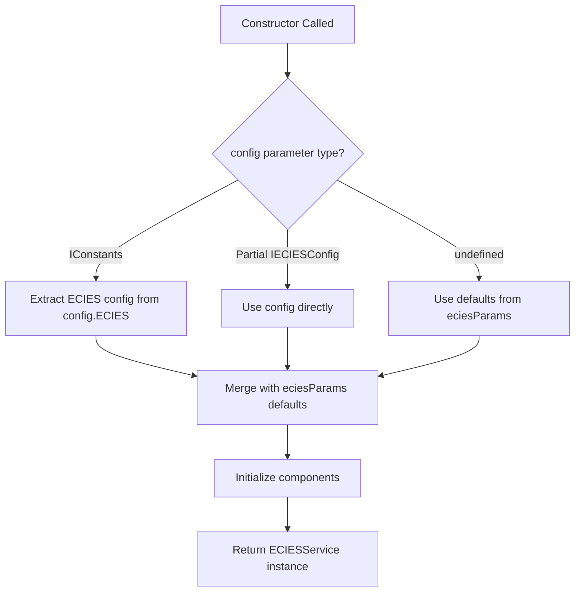

# Design Document: Fix ECIESService Constructor Signature

## Overview

This design addresses a TypeScript signature mismatch in the `ECIESService` constructor across both `@digitaldefiance/ecies-lib` (browser) and `@digitaldefiance/node-ecies-lib` (Node.js). The issue is that the documented API shows passing `IConstants` (returned by `createRuntimeConfiguration`) directly to the constructor, but the TypeScript signature only accepts `Partial<IECIESConfig>`, causing type errors despite working correctly at runtime.

The fix involves updating the constructor signature to accept a union type that includes both `Partial<IECIESConfig>` and `IConstants`, maintaining full backward compatibility while enabling the documented usage pattern.

## Architecture

### Current State

**Browser Library (`ecies-lib`):**
```typescript
constructor(
  config?: Partial<IECIESConfig>,
  eciesParams: IECIESConstants = Constants.ECIES,
)
```

**Node.js Library (`node-ecies-lib`):**
```typescript
constructor(
  config?: Partial<IECIESConfig>,
  eciesParams: IECIESConstants = Constants.ECIES,
)
```

**Problem:** The `IConstants` interface (which includes `idProvider` and all cryptographic constants) is not accepted by the constructor, even though:
1. The README documents this usage pattern
2. The implementation handles it correctly at runtime
3. Users need to use `as any` or type assertions to work around the issue

### Target State

**Both Libraries:**
```typescript
constructor(
  config?: Partial<IECIESConfig> | IConstants,
  eciesParams?: IECIESConstants,
)
```

**Benefits:**
1. TypeScript accepts `IConstants` from `createRuntimeConfiguration`
2. Backward compatible with existing `Partial<IECIESConfig>` usage
3. Matches documented API usage
4. Consistent across both browser and Node.js libraries

## Components and Interfaces

### Type Relationships

```typescript
// IECIESConfig - Subset of configuration (ECIES-specific only)
interface IECIESConfig {
  curveName: string;
  primaryKeyDerivationPath: string;
  mnemonicStrength: number;
  symmetricAlgorithm: string;
  symmetricKeyBits: number;
  symmetricKeyMode: string;
}

// IConstants - Complete runtime configuration (superset)
interface IConstants {
  // Includes all IECIESConfig fields via ECIES.* properties
  ECIES: IECIESConstants;
  
  // Plus additional fields
  idProvider: IIdProvider;
  MEMBER_ID_LENGTH: number;
  CHECKSUM: IChecksumConsts;
  PBKDF2: IPBkdf2Consts;
  // ... other constants
}
```

### Type Guard Implementation

The constructor implementation needs to distinguish between `IConstants` and `Partial<IECIESConfig>` to extract the correct values:

```typescript
function isIConstants(config: any): config is IConstants {
  return config && 
         typeof config === 'object' && 
         'ECIES' in config && 
         'idProvider' in config;
}
```

### Constructor Logic Flow



## Data Models

### Input Types

**Option 1: IConstants (from createRuntimeConfiguration)**
```typescript
const config = createRuntimeConfiguration({
  idProvider: new GuidV4Provider()
});
// config is IConstants
const ecies = new ECIESService(config);
```

**Option 2: Partial<IECIESConfig> (legacy)**
```typescript
const config = {
  curveName: 'secp256k1',
  symmetricAlgorithm: 'aes-256-gcm'
};
// config is Partial<IECIESConfig>
const ecies = new ECIESService(config);
```

**Option 3: No config (use defaults)**
```typescript
const ecies = new ECIESService();
```

### Implementation Strategy

The constructor will:
1. Check if `config` is `IConstants` using a type guard
2. If `IConstants`, extract ECIES-specific config from `config.ECIES.*` properties
3. If `Partial<IECIESConfig>`, use directly
4. Merge with `eciesParams` defaults
5. Initialize all components

## Correctness Properties

*A property is a characteristic or behavior that should hold true across all valid executions of a system—essentially, a formal statement about what the system should do. Properties serve as the bridge between human-readable specifications and machine-verifiable correctness guarantees.*

### Property 1: IConstants Acceptance

*For any* valid `IConstants` object returned by `createRuntimeConfiguration`, passing it to the `ECIESService` constructor should compile without TypeScript errors and create a valid service instance.

**Validates: Requirements 1.1, 2.1**

### Property 2: Backward Compatibility

*For any* existing code that passes `Partial<IECIESConfig>` to the constructor, the code should continue to compile and execute identically after the signature change.

**Validates: Requirements 5.1, 5.2**

### Property 3: Cross-Platform Consistency

*For any* valid configuration object, passing it to `ECIESService` in the browser library should have the same TypeScript behavior as passing it to `ECIESService` in the Node.js library.

**Validates: Requirements 3.1, 3.2**

### Property 4: Configuration Extraction

*For any* `IConstants` object with ECIES configuration, the constructor should correctly extract and apply the ECIES-specific settings from the `ECIES` property.

**Validates: Requirements 1.1, 2.1**

### Property 5: Default Parameter Handling

*For any* constructor call where `eciesParams` is omitted, the service should use `Constants.ECIES` as the default value.

**Validates: Requirements 5.2**

## Error Handling

### Type Validation

The constructor should handle invalid inputs gracefully:

1. **Invalid config type**: If `config` is not an object, treat as undefined
2. **Malformed IConstants**: If `config` has `ECIES` property but it's invalid, fall back to defaults
3. **Missing required fields**: Use defaults from `eciesParams` for any missing fields

### Error Messages

No new error messages are needed. The existing validation in the constructor body will continue to work as-is.

## Testing Strategy

### Unit Tests

**Test Suite 1: Type Acceptance**
- Test that `IConstants` compiles without errors
- Test that `Partial<IECIESConfig>` compiles without errors
- Test that `undefined` compiles without errors

**Test Suite 2: Runtime Behavior**
- Test constructor with `IConstants` creates valid service
- Test constructor with `Partial<IECIESConfig>` creates valid service
- Test constructor with no parameters creates valid service
- Test that ECIES config is correctly extracted from `IConstants`

**Test Suite 3: Backward Compatibility**
- Test existing usage patterns continue to work
- Test that service behavior is identical for equivalent configs

**Test Suite 4: Cross-Platform Consistency**
- Test that browser and Node.js libraries accept same types
- Test that both libraries produce equivalent services

### Property-Based Tests

Property-based tests will use a minimum of 100 iterations per test to ensure comprehensive coverage through randomization.

**Property Test 1: IConstants Acceptance**
- Generate random `IConstants` objects
- Verify constructor accepts them without errors
- Verify service is correctly initialized
- **Feature: fix-ecies-constructor-signature, Property 1: IConstants Acceptance**

**Property Test 2: Backward Compatibility**
- Generate random `Partial<IECIESConfig>` objects
- Verify constructor behavior is unchanged
- **Feature: fix-ecies-constructor-signature, Property 2: Backward Compatibility**

**Property Test 3: Configuration Extraction**
- Generate random `IConstants` with various ECIES configs
- Verify correct extraction of ECIES settings
- **Feature: fix-ecies-constructor-signature, Property 3: Configuration Extraction**

### Integration Tests

**Test documented usage pattern:**
```typescript
const config = createRuntimeConfiguration({
  idProvider: new GuidV4Provider()
});
const ecies = new ECIESService(config);
// Should compile and work correctly
```

**Test cross-platform consistency:**
```typescript
// Same test in both libraries
import { ECIESService, createRuntimeConfiguration } from '@digitaldefiance/ecies-lib';
// vs
import { ECIESService, createRuntimeConfiguration } from '@digitaldefiance/node-ecies-lib';
```

## Implementation Notes

### Files to Modify

**Browser Library:**
- `packages/digitaldefiance-ecies-lib/src/services/ecies/service.ts`

**Node.js Library:**
- `packages/digitaldefiance-node-ecies-lib/src/services/ecies/service.ts`

### Import Requirements

Both files need to import `IConstants`:

**Browser Library:**
```typescript
import type { IConstants } from '../../interfaces/constants';
```

**Node.js Library:**
```typescript
import type { IConstants } from '@digitaldefiance/ecies-lib';
```

### Constructor Implementation Pattern

```typescript
constructor(
  config?: Partial<IECIESConfig> | IConstants,
  eciesParams: IECIESConstants = Constants.ECIES,
) {
  // Type guard to check if config is IConstants
  const isFullConfig = config && 'ECIES' in config && 'idProvider' in config;
  
  // Extract ECIES config
  const eciesConfig: Partial<IECIESConfig> = isFullConfig
    ? {
        curveName: (config as IConstants).ECIES.CURVE_NAME,
        primaryKeyDerivationPath: (config as IConstants).ECIES.PRIMARY_KEY_DERIVATION_PATH,
        mnemonicStrength: (config as IConstants).ECIES.MNEMONIC_STRENGTH,
        symmetricAlgorithm: (config as IConstants).ECIES.SYMMETRIC.ALGORITHM,
        symmetricKeyBits: (config as IConstants).ECIES.SYMMETRIC.KEY_BITS,
        symmetricKeyMode: (config as IConstants).ECIES.SYMMETRIC.MODE,
      }
    : (config as Partial<IECIESConfig> | undefined) || {};
  
  // Merge with defaults
  this._config = {
    curveName: eciesParams.CURVE_NAME,
    primaryKeyDerivationPath: eciesParams.PRIMARY_KEY_DERIVATION_PATH,
    mnemonicStrength: eciesParams.MNEMONIC_STRENGTH,
    symmetricAlgorithm: eciesParams.SYMMETRIC.ALGORITHM,
    symmetricKeyBits: eciesParams.SYMMETRIC.KEY_BITS,
    symmetricKeyMode: eciesParams.SYMMETRIC.MODE,
    ...eciesConfig,
  };
  
  // Rest of initialization remains unchanged
}
```

## Migration Guide

### For Users

No migration needed! This change is fully backward compatible. Existing code will continue to work without modification.

**Before (with workaround):**
```typescript
const config = createRuntimeConfiguration({ idProvider: new GuidV4Provider() });
const ecies = new ECIESService(config as any); // Type assertion needed
```

**After (clean):**
```typescript
const config = createRuntimeConfiguration({ idProvider: new GuidV4Provider() });
const ecies = new ECIESService(config); // Works without assertion
```

### For Maintainers

1. Update constructor signature in both libraries
2. Add type guard logic to distinguish `IConstants` from `Partial<IECIESConfig>`
3. Extract ECIES config from `IConstants` when needed
4. Run existing test suites to verify backward compatibility
5. Add new tests for `IConstants` acceptance

## Alternative Approaches Considered

### Alternative 1: Function Overloads

```typescript
constructor(config: IConstants);
constructor(config?: Partial<IECIESConfig>, eciesParams?: IECIESConstants);
constructor(config?: Partial<IECIESConfig> | IConstants, eciesParams?: IECIESConstants) {
  // implementation
}
```

**Pros:**
- More explicit type signatures
- Better IntelliSense/autocomplete

**Cons:**
- More verbose
- Requires duplicate JSDoc comments
- Doesn't provide significant benefit over union type

**Decision:** Use union type (simpler and sufficient)

### Alternative 2: Separate Factory Method

```typescript
static fromConstants(config: IConstants): ECIESService {
  return new ECIESService(/* extract config */);
}
```

**Pros:**
- Explicit intent
- No constructor complexity

**Cons:**
- Breaking change (requires code updates)
- Inconsistent with documented API
- Adds API surface area

**Decision:** Rejected (not backward compatible)

### Alternative 3: Accept Only IConstants

```typescript
constructor(config?: IConstants, eciesParams?: IECIESConstants)
```

**Pros:**
- Simplest signature
- Forces use of `createRuntimeConfiguration`

**Cons:**
- Breaking change
- Removes flexibility
- Requires all users to update code

**Decision:** Rejected (not backward compatible)

## Conclusion

The union type approach (`Partial<IECIESConfig> | IConstants`) provides the best balance of:
- Backward compatibility (no breaking changes)
- Type safety (accepts documented usage)
- Simplicity (minimal code changes)
- Consistency (same signature in both libraries)

The implementation is straightforward, requiring only:
1. Update constructor signature
2. Add type guard logic
3. Extract ECIES config when needed
4. Verify with tests

This fix will eliminate the need for type assertions and make the library's TypeScript API match its documented behavior.
