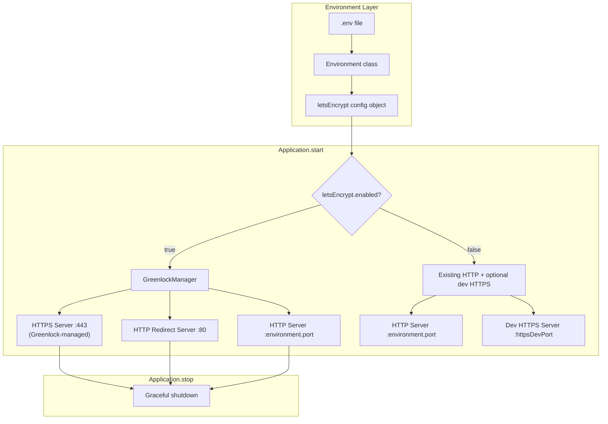

# Design Document: Let's Encrypt Greenlock Support

## Overview

This design adds automated Let's Encrypt TLS certificate management to the `@digitaldefiance/node-express-suite` package using `greenlock-express`. The integration is opt-in via environment variables and coexists with the existing dev-certificate HTTPS support. When enabled, the Application class delegates HTTPS server creation to Greenlock, starts an HTTP-to-HTTPS redirect server on port 80, and continues to serve the primary Express app on the configured `environment.port` for internal/health-check traffic.

The design follows the existing patterns in the codebase: configuration flows through `IEnvironment` → `Environment` → `Application`, and the server lifecycle is managed within the `start()`/`stop()` methods.

## Architecture



The key architectural decision is to encapsulate all Greenlock logic in a dedicated `GreenlockManager` class rather than inlining it into `Application.start()`. This keeps the Application class focused on orchestration and makes the Greenlock integration testable in isolation.

## Components and Interfaces

### 1. `ILetsEncryptConfig` Interface

New interface added to `src/interfaces/environment.ts` representing the Let's Encrypt configuration block.

```typescript
export interface ILetsEncryptConfig {
  /** Whether Let's Encrypt is enabled */
  enabled: boolean;
  /** Contact email for Let's Encrypt account (required when enabled) */
  maintainerEmail: string;
  /** List of hostnames to obtain certificates for */
  hostnames: string[];
  /** Use Let's Encrypt staging directory for testing */
  staging: boolean;
  /** Directory for Greenlock config and certificate storage */
  configDir: string;
}
```

### 2. `IEnvironment` Extension

Add `letsEncrypt` field to the existing `IEnvironment` interface:

```typescript
export interface IEnvironment<TID extends PlatformID = Buffer> {
  // ... existing fields ...
  
  /** Let's Encrypt / Greenlock configuration */
  letsEncrypt: ILetsEncryptConfig;
}
```

### 3. `Environment` Class Updates

The `Environment` constructor parses new environment variables:

| Env Variable | Maps To | Default |
|---|---|---|
| `LETS_ENCRYPT_ENABLED` | `letsEncrypt.enabled` | `false` |
| `LETS_ENCRYPT_EMAIL` | `letsEncrypt.maintainerEmail` | (required when enabled) |
| `LETS_ENCRYPT_HOSTNAMES` | `letsEncrypt.hostnames` | (required when enabled) |
| `LETS_ENCRYPT_STAGING` | `letsEncrypt.staging` | `false` |
| `LETS_ENCRYPT_CONFIG_DIR` | `letsEncrypt.configDir` | `./greenlock.d` |

Validation rules added to the constructor:
- When `enabled` is `true`, `maintainerEmail` must be non-empty
- When `enabled` is `true`, `hostnames` must contain at least one entry
- Each hostname must match either a valid FQDN pattern or `*.domain.tld` wildcard pattern

### 4. `GreenlockManager` Class

New class at `src/greenlock-manager.ts` that encapsulates all Greenlock-Express interaction.

```typescript
export class GreenlockManager {
  private greenlockInstance: any; // greenlock-express does not ship types
  private httpsServer: Server | null = null;
  private redirectServer: Server | null = null;

  constructor(private readonly config: ILetsEncryptConfig) {}

  /**
   * Initialize Greenlock and start HTTPS + HTTP redirect servers.
   * Returns a promise that resolves when both servers are listening.
   */
  async start(expressApp: ExpressApplication): Promise<void>;

  /**
   * Gracefully shut down both servers, closing all connections.
   */
  async stop(): Promise<void>;
}
```

Key behaviors:
- `start()` calls `greenlock-express.init()` with the configured options, then calls `.ready()` to get the HTTPS and redirect servers
- The redirect server on port 80 handles ACME HTTP-01 challenges and 301-redirects all other traffic
- `stop()` calls `closeAllConnections()` (if available) then `close()` on both servers

### 5. `Application` Class Updates

In `Application.start()`:
- After middleware/router setup, check `this.environment.letsEncrypt.enabled`
- If enabled: create a `GreenlockManager`, call `greenlockManager.start(this.expressApp)`, and still start the primary HTTP server on `environment.port`
- If enabled: skip the existing `httpsDevCertRoot` block
- In `Application.stop()`: call `greenlockManager.stop()` if it exists

Store the manager as a private field:
```typescript
private greenlockManager: GreenlockManager | null = null;
```

## Data Models

### `ILetsEncryptConfig`

```typescript
{
  enabled: boolean;          // default: false
  maintainerEmail: string;   // e.g. "[email]"
  hostnames: string[];       // e.g. ["example.com", "*.example.com"]
  staging: boolean;          // default: false
  configDir: string;         // default: "./greenlock.d"
}
```

### Hostname Validation

Hostnames are validated against these patterns:
- FQDN: `/^([a-zA-Z0-9]([a-zA-Z0-9-]{0,61}[a-zA-Z0-9])?\.)+[a-zA-Z]{2,}$/`
- Wildcard: `/^\*\.([a-zA-Z0-9]([a-zA-Z0-9-]{0,61}[a-zA-Z0-9])?\.)+[a-zA-Z]{2,}$/`

### Environment Variable Parsing

The comma-separated `LETS_ENCRYPT_HOSTNAMES` string is parsed by splitting on `,`, trimming whitespace from each entry, and filtering out empty strings.


## Correctness Properties

*A property is a characteristic or behavior that should hold true across all valid executions of a system — essentially, a formal statement about what the system should do. Properties serve as the bridge between human-readable specifications and machine-verifiable correctness guarantees.*

### Property 1: Boolean environment variable parsing

*For any* environment variable value string `v` where `v` is one of `"true"`, `"1"`, `"false"`, `"0"`, `""`, or `undefined`, parsing `LETS_ENCRYPT_ENABLED` (or `LETS_ENCRYPT_STAGING`) with value `v` should produce `true` if and only if `v` is `"true"` or `"1"`.

**Validates: Requirements 1.2, 1.5**

### Property 2: Hostname list parsing round-trip

*For any* array of valid hostname strings, joining them with commas into a single string and then parsing that string via the comma-separated hostname parser should produce an array equal to the original array (after trimming whitespace from each entry).

**Validates: Requirements 1.4**

### Property 3: Config directory default behavior

*For any* environment configuration, if `LETS_ENCRYPT_CONFIG_DIR` is provided as a non-empty string `d`, then `letsEncrypt.configDir` should equal `d`. If `LETS_ENCRYPT_CONFIG_DIR` is absent or empty, then `letsEncrypt.configDir` should equal `"./greenlock.d"`.

**Validates: Requirements 1.6**

### Property 4: HTTP-to-HTTPS redirect correctness

*For any* HTTP request with host `h` and path `p`, the HTTP redirect server should respond with status 301 and a `Location` header equal to `https://{h}{p}`.

**Validates: Requirements 3.2**

### Property 5: Wildcard hostname triggers DNS-01 challenge

*For any* hostname string matching the wildcard pattern `*.domain.tld`, the Greenlock configuration should specify DNS-01 as the challenge type for that hostname entry.

**Validates: Requirements 5.2**

### Property 6: Hostname validation correctness

*For any* string `s`, the hostname validator should accept `s` if and only if `s` matches either the FQDN regex `/^([a-zA-Z0-9]([a-zA-Z0-9-]{0,61}[a-zA-Z0-9])?\.)+[a-zA-Z]{2,}$/` or the wildcard regex `/^\*\.([a-zA-Z0-9]([a-zA-Z0-9-]{0,61}[a-zA-Z0-9])?\.)+[a-zA-Z]{2,}$/`.

**Validates: Requirements 5.3**

## Error Handling

### Environment Construction Errors

| Condition | Error |
|---|---|
| `letsEncrypt.enabled` is `true` and `LETS_ENCRYPT_EMAIL` is missing/empty | `TranslatableSuiteError` with a descriptive key |
| `letsEncrypt.enabled` is `true` and `LETS_ENCRYPT_HOSTNAMES` is missing/empty | `TranslatableSuiteError` with a descriptive key |
| A hostname in `LETS_ENCRYPT_HOSTNAMES` fails validation | `TranslatableSuiteError` with the invalid hostname in the message |

### Runtime Errors

| Condition | Handling |
|---|---|
| Greenlock initialization fails | Log the error via `console.error`, do not start HTTPS/redirect servers, allow the primary HTTP server to continue |
| HTTPS server fails to bind port 443 | Log the error, throw in test mode, `process.exit(1)` in production (matching existing pattern) |
| HTTP redirect server fails to bind port 80 | Log the error, continue without redirect (HTTPS still works, just no redirect) |
| Certificate renewal failure | Handled internally by Greenlock; logged via Greenlock's event system |

### Graceful Degradation

When Let's Encrypt is enabled but Greenlock fails to initialize, the Application falls back to the primary HTTP server on `environment.port` only. The dev-certificate HTTPS path is still skipped (since the intent was to use Let's Encrypt), and a warning is logged.

## Testing Strategy

### Property-Based Testing

The project already uses `fast-check` (present in devDependencies). All property tests will use `fast-check` with a minimum of 100 iterations per property.

Each property test must be tagged with a comment:
```
// Feature: letsencrypt-greenlock-support, Property N: <property title>
```

Properties to implement:
1. **Property 1**: Boolean env var parsing — generate random boolean-like strings, verify parsing
2. **Property 2**: Hostname list round-trip — generate arrays of valid hostnames, verify join→parse round-trip
3. **Property 3**: Config dir default — generate optional string values, verify default behavior
4. **Property 4**: HTTP redirect correctness — generate random hosts and paths, verify 301 + Location header
5. **Property 5**: Wildcard DNS-01 — generate wildcard hostnames, verify challenge type
6. **Property 6**: Hostname validation — generate random strings (both valid and invalid), verify validator agrees with regex

### Unit Testing

Unit tests complement property tests for specific examples and edge cases:

- **Environment validation**: Test that missing email/hostnames when enabled throws the correct error
- **Environment disabled path**: Test that when disabled, letsEncrypt config has sensible defaults and no validation errors
- **GreenlockManager mock tests**: Mock `greenlock-express` to verify it's called with correct config
- **Application lifecycle**: Mock GreenlockManager to verify start/stop orchestration
- **Mutual exclusion**: Verify dev HTTPS is skipped when Let's Encrypt is enabled
- **Backward compatibility**: Verify existing behavior is unchanged when Let's Encrypt is disabled

### Test File Organization

- `src/__tests__/letsencrypt-config.spec.ts` — Environment parsing and validation tests (unit + property)
- `src/__tests__/greenlock-manager.spec.ts` — GreenlockManager tests with mocked greenlock-express
- `src/__tests__/application-letsencrypt.spec.ts` — Application integration tests for Let's Encrypt lifecycle
